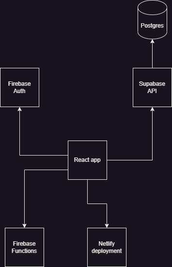

# VRCArena Web Client

The React web client for the website [VRCArena](https://www.vrcarena.com)

## Getting Started

Tested with Node 16.

I use [Create React App](https://create-react-app.dev/) with a `.env` file to point the app to various services:

- Firebase for authentication
- Firebase for serverless functions
- Firebase for static storage (migrating away)
- Supabase for database
- Supabase for static storage
- Netlify for deployment

Run it locally:

    cp .env.example .env
    npm i
    npm start

If you are using the Firebase emulator you can switch to it:

    npm run start:emulators

## Deployment

All merges to master will trigger automatic deployment with Netlify.

## Contribution

Fork the repo, create a branch and open a pull request with your changes.

### Backend changes

Open an issue in this repo for any changes to the Firebase or SQL logic.

## Roadmap

### TypeScript

I am in the process of migrating from JavaScript to TypeScript so you will see half and half.
